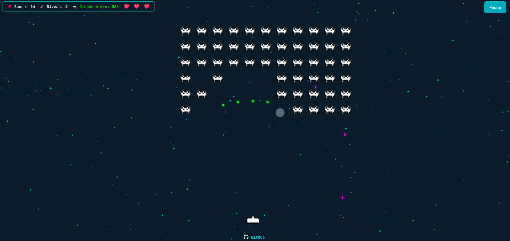

# Space Invader Personal Site Game

Mini-jeu **Space Invader** intégré à un site personnel ([berthel.me](https://berthel.me)), conçu pour être facilement personnalisable via un simple fichier de configuration.

---

## Table des matières

1. [Aperçu du projet](#aperçu-du-projet)  
2. [Structure du dépôt](#structure-du-dépôt)  
3. [Capture d’écran](#capture-décran)  
4. [Configuration](#configuration)  
5. [Logique de jeu](#logique-de-jeu)  
    - [Flux des scènes](#flux-des-scènes)  
    - [Vaisseau (Player)](#vaisseau-player)  
    - [Ennemis](#ennemis)  
    - [Armes & améliorations](#armes--améliorations)  
    - [Drops & rarité](#drops--rarité)  
    - [Difficulté & progression](#difficulté--progression)  
6. [Interface & HUD](#interface--hud)  
7. [Contrôles](#contrôles)  
8. [Charte graphique](#charte-graphique)  
9. [Assets & crédits](#assets--crédits)  
10. [Installation & développement](#installation--développement)  
11. [Licence](#licence)  

---

## Aperçu du projet

- **Objectif** : Offrir un jeu Space Invader simple, moderne et personnalisable, utilisable comme easter-egg ou démonstrateur technique sur un site personnel.
- **Technologies** :  
  - **Front-end** : HTML/CSS natif, JavaScript ES Modules, Canvas API (ou Phaser 3 si version avancée).
  - **Mobile-friendly** : Contrôles tactiles natifs intégrés (flèches + bouton "Tirer").
- **Personnalisation** : Difficulté, progression et rareté des bonus 100% paramétrables via `config.js`.

---

## Structure du dépôt

```
/
├ assets/
│   ├ img/
│   └ sounds/
├ js/
│   ├ audioManager.js
│   ├ cheatMenu.js
│   ├ drops.js
│   ├ enemies.js
│   ├ enemyWeapons.js
│   ├ explosionManager.js
│   ├ hud.js
│   ├ main.js
│   ├ particles-config.js
│   ├ player.js
│   ├ sceneBoot.js
│   ├ sceneGame.js
│   ├ sceneOver.js
│   ├ sceneOverlay.js
│   └ weapons.js
├ CNAME
├ config.js
├ index.html
├ README.md
└ style.css
```

---

## Capture d’écran



---

## Configuration

La personnalisation du jeu s’effectue via **`config.js`** (aucune modification du code principal nécessaire) :

- **Vitesse de base** (`baseSpeed`) du vaisseau et des ennemis.
- **Progression** : facteurs exponentiels (`SPEED_FACTOR`, `COUNT_FACTOR`).
- **Taux de drop** global (`dropRate`, ex. 0.05 pour 5%).
- **Pondération** des armes dans les drops (`dropWeights`).
- **Niveau maximal** pour chaque type d’arme.
- **Paramètres mobiles** : taille et placement des boutons tactiles, sensibilité.

Exemple d’options (extrait du fichier de config) :
```js
export default {
  baseSpeed: 2.5,
  speedFactor: 1.07,
  countFactor: 1.1,
  dropRate: 0.05,
  dropWeights: { classic: 0.6, spread: 0.25, explosive: 0.1, piercing: 0.05 },
  maxWeaponLevel: 5,
  mobile: { buttonSize: 60 }
}
```
*Astuce : pour ajuster la difficulté, il suffit de modifier ce fichier puis de recharger la page.*

---

## Logique de jeu

### Flux des scènes

1. **Boot** : Préchargement des assets (sprites, sons) et initialisation des entrées (clavier/tactile).
2. **Tuto** : Overlay type terminal (`invader@berthel.me:~$_`) avec clignotant, tutoriel et crédits.
3. **Game** : Boucle principale : gestion du joueur, ennemis, collisions, génération, drops.
4. **Game Over** : Overlay final (“GAME OVER”), affichage du score, bouton “Rejouer”.

### Vaisseau (Player)

- Mouvement horizontal uniquement (`0` à `canvas.width - ship.width`).
- 3 vies (♥ ×3, affichées dans le HUD).
- Touche Espace ou bouton tactile pour tirer.
- Récupération d’armes : améliore le niveau de l’arme courante (max 5), changement de type = reset niveau.

### Ennemis

- **Génération procédurale** en fonction du niveau :
    ```js
    rows = config.baseRows + Math.floor(level / 2);
    cols = config.baseCols + (level % config.baseCols);
    ```
- **Vitesse évolutive** :
    ```js
    enemySpeed = config.baseSpeed * Math.pow(config.speedFactor, level - 1);
    ```
- Mouvement de groupe avec descente à chaque bord atteint.

### Armes & améliorations

4 types d’armes, chacune upgradable jusqu’au niveau 5 :
1. **Classic** : tir simple, 1 projectile.
2. **Spread** : cône de tirs multiples, nombre dépend du niveau.
3. **Explosive** : tir explosif, zone d’effet croissante.
4. **Piercing** : traverse plusieurs ennemis (jusqu’à `level`).

- **Pickup d’un même type** : up niveau (bonus de score au-delà du niveau max).
- **Pickup autre type** : changement de type, niveau = 1.

### Drops & rarité

- **À chaque ennemi tué** : tirage selon `dropRate` (ex : 5% de chance).
- Si drop : type choisi selon `dropWeights` (poids paramétrables).
- Les drops tombent, récupération par collision avec le vaisseau.

### Difficulté & progression

- Progression exponentielle : nombre, vitesse et cadence de tir des ennemis.
- DropRate diminue légèrement à chaque niveau.
- Tous les paramètres sont ajustables via `config.js`.

---

## Interface & HUD

- **HUD** coin supérieur gauche : Score, Niveau, Arme courante + niveau.
- **Vies** coin supérieur droit : Cœurs ♥.
- **Overlay** : Effet terminal avec clignotant (_).

---

## Contrôles

**Desktop :**
- ← / → : déplacer le vaisseau
- Espace : tirer

**Mobile :**
- Flèches tactiles affichées à l’écran
- Bouton “Tirer” tactile dédié

---

## Charte graphique

### Palette de couleurs

| Usage            | Code                  |
| ---------------- | --------------------- |
| Fond principal   | `#0A1B2A`             |
| Étoiles & texte  | `#00DBE8`             |
| HUD background   | `rgba(10,27,42,0.85)` |
| Bordures & hover | `#00AABF`             |
| Vies (cœurs)     | `red`                 |

### Typographie

- **Police principale** : `JetBrains Mono`, monospace pour un rendu terminal rétro/moderne.
- **Effet clignotant** (overlay terminal) via CSS :
    ```css
    #overlay-title::after {
      content: '_';
      animation: blink 1s infinite;
    }
    @keyframes blink { 0%,50%{opacity:1;}51%,100%{opacity:0;} }
    ```

---

## Assets & crédits

- **Sprites** : `/assets/img/` (vaisseau, ennemis, drops…)
- **Sons** : `/assets/sounds/` (shoot.wav, explosion.wav…)
- **Crédits** : classicgaming.cc (sprites et sons), Sound design maison.

Merci de respecter les licences des assets tiers lors de la redistribution du jeu.

---

## Installation & développement

1. **Cloner le dépôt :**
    ```sh
    git clone https://github.com/TONPROFIL/mon-space-invader.git
    cd mon-space-invader
    ```
2. **Lancer en local** :
    - Avec VS Code + extension *Live Server* (recommandé)
    - Ou :
      ```sh
      npx http-server .
      ```
3. **Développement :**
    - Modifier `config.js` pour personnaliser la difficulté, la progression, la rareté.
    - Personnaliser les modules dans `/js/` si besoin de fonctionnalités avancées.

---

## Licence

Ce projet est publié sous licence **MIT** (voir le fichier `LICENSE`).  
Vous êtes libre de l’utiliser, le modifier, le partager pour tout usage non commercial.  
Merci de citer ce dépôt si vous réutilisez tout ou partie du code ou des assets.

---
